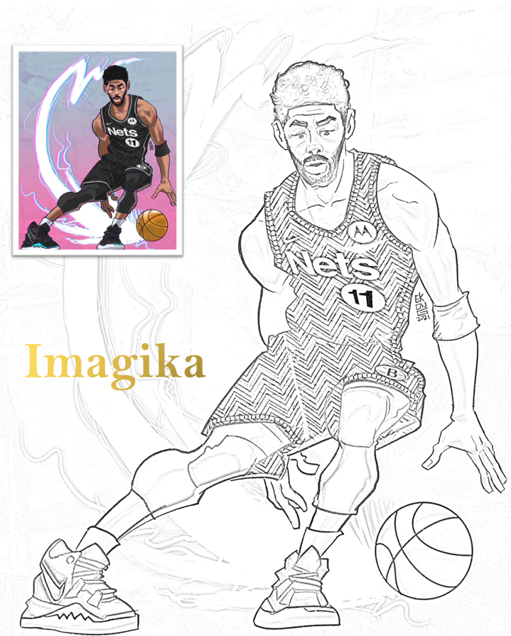
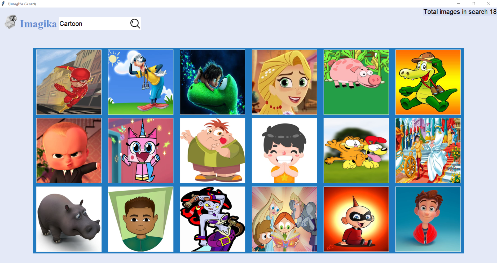

# Imagika

It is Imagika, Convert images to pencil sketch....



## Features / Tasks it can perform:

1. Convert Images to Pencil Sketch
2. User Friendly GUI  
   (a) Modal window for image input in multiple extension  
   (b) Modal window to save image in multiple extension  
   (c) Option to view recent images in GUI
3. Saves images with same name as user input
4. Import images from online and convert it.




## Modules Installation:

pip install tkinter  
pip install Pillow  
pip install opencv-python
pip install bs4

## Module Requirements:

1. tkinter
2. Pillow(PIL)
3. opencv(CV2)
4. datetime
5. time
6. os
7. glob
8. Beautiful Soup
9. Threading
10. Shutil
11. Urllib

```
4,5,6 are Python inbuild modules
Python 3.9.8
```

## Dependencies:

1. fileHandler
2. sketch_generator
3. fetch_image

## Assets:

1. image

## Author

**vijay-kumar-yadav**


